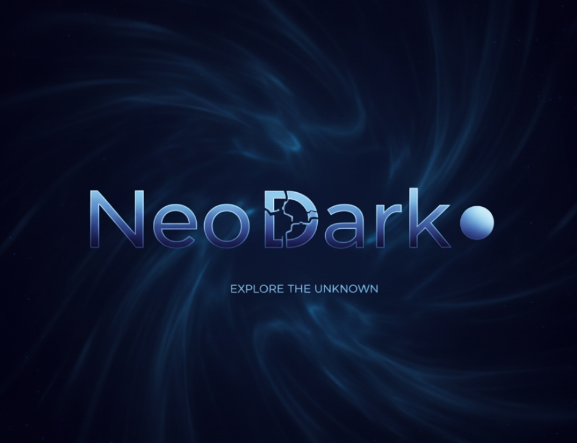

# NeoDark CLI

  
  
  
  

  

## 🌐 Язык/Language
- [English Version](en_README.md)

## 📖 Описание

NeoDark CLI - это мощная экосистема инструментов командной строки для Windows, объединяющая широкий спектр функций от системного обслуживания до сетевых утилит. Проект предоставляет удобный интерфейс командной строки с современным дизайном и широкими возможностями.

## 🔧 Стек технологий

- **Основной язык**: Python 3.8+
- **Платформа**: Windows
- **Вспомогательные технологии**:
  - Batch-скрипты (.bat)
  - Системные вызовы Windows API
  - Работа с реестром Windows
  - Сетевые протоколы и утилиты
- **Библиотеки Python**:
  - ctypes (для работы с Windows API)
  - urllib (для сетевых запросов)
  - subprocess (для запуска внешних процессов)
  - platform (для получения информации о системе)
  - os, sys (стандартные библиотеки)

## 🎯 Основные возможности

### Системные инструменты:
- Синхронизация продуктов
- Мониторинг системы
- Автозапуск
- Оптимизация системы
- Аудит безопасности
- Управление задачами

### Сетевые функции:
- Zapret DPI (обход блокировок)
- SpeedTest
- Порт сканнер
- Геолокация IP
- Проверка репутации IP

### Управление аккаунтами:
- Авторизация пользователей
- Смена паролей
- Гостевые аккаунты
- Управление сессиями

### Разработка и тестирование:
- Инструменты разработчика
- Патчинг файлов
- Поиск по файлам
- Управление горячими клавишами

## ⚠️ Лицензия

  

**СТРОГО ЗАКРЫТАЯ ЛИЦЕНЗИЯ**

Этот проект защищен строго закрытой лицензией. Любое копирование, распространение, модификация или использование кода без явного письменного разрешения правообладателя строго запрещено.

### Что запрещено:
- Копирование и распространение кода
- Модификация исходного кода без разрешения
- Использование в коммерческих целях
- Публикация проекта или его частей
- Создание производных работ

### Что разрешено:
- Использование в личных целях в рамках установленной копии
- Обратная связь и сообщения об ошибках

## 📞 Контакты

Для получения дополнительной информации обращайтесь к создателю проекта: [t.me/weeaave]

---
© 2025 NeoDark Ecosystem. Все права защищены.
